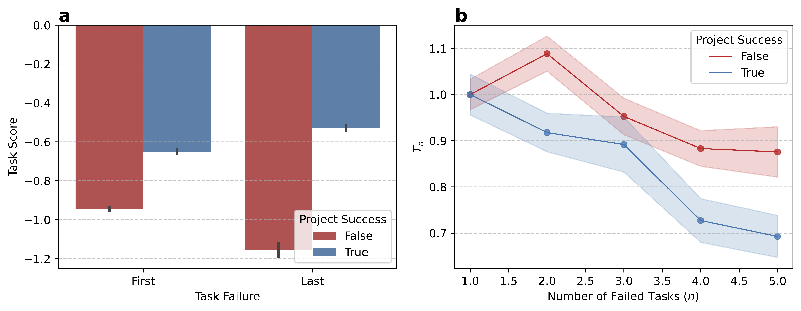

# Seven years of project time-tracking data from Gryzzly capturing dynamics of collaboration and project failure
This repository contains code related to the paper [Seven years of project time-tracking data from Gryzzly capturing dynamics of collaboration and project failure](https://github.com/jaklevab/gryzzly/edit/main/README.md) (currently in submission).

This repository contains the code needed to prepare the data and reproduce the analysis on project failure and its drivers.

<p float="left">
  
</p>


Setup
-----

This project uses mostly Python . To replicate our results, using pip, set up the environment  with the provided with `pip install -r requirements.txt` (this builds the python extensions in this package, and installs them locally).

Datasets folders
----------------

This project relies upon seven datasets. 

* __Declarations Dataset__

* __User and Teams Datasets__

* __Task and Task Computation Datasets__

* __Project and Project Computation Datasets__
As a result, your dataset folder should look like the following:
```
data
├── declarations.csv
├── users.csv
├── teams.csv
├── projects.csv   
├── projects_computed.csv   
├── tasks.csv   
├── tasks_computed.csv   

./
├── Figures.ipynb    # Jupyter Notebook to reproduce the paper figures
├── helper_files.py  # Helper methods for data handling
├── requirements.txt # pip requirements file
└── clean_data.sh 	 # Cleaning file used to export the figshare dataset

figures
├── circ_ccdf_hour_iet.pdf    # Figure 2
├── failure_streaks.pdf       # Figure 5      
└── forest_plot.pdf           # Figure 7    
└── network_stats.pdf         # Figure 4         
└── project_fail_overview.pdf # Figure 3              
└── project_task_failure.pdf  # Figure 6  
```

Analysis
--------
Once the datasets are compiled and the environment is compiled, you can run the notebook to reproduce the paper figures. 
Computations were done on an IntelR XeonR CPU E5-2643 v3 @ 3.40GHz with 40GB RAM. The notebook execution took  approximately 40 minutes.

### Citation
If you use the code, data, or analysis results in this paper, we kindly ask that you cite the paper above as:

> _Seven years of project time-tracking data from Gryzzly capturing dynamics of collaboration and project failure_ , J. Levy Abitbol, L. Arod, 2024, .
